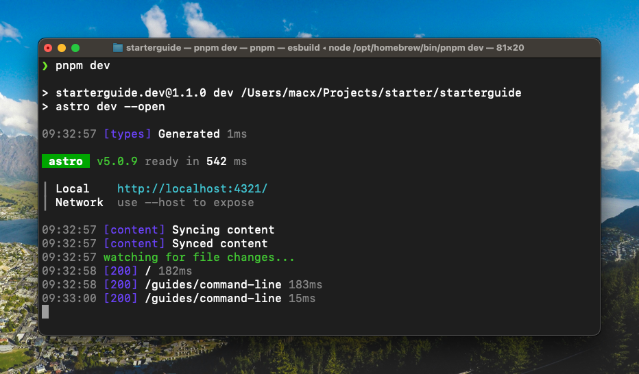

import Lead from '@components/Lead.astro'
import { FileTree } from '@astrojs/starlight/components'

<Lead>
  Mit der Kommandozeile kannst du auf Textbasis mit deinem Computer
  interagieren, in dem du Befehle eingibst und dieser darauf reagiert.
</Lead>



Die Kommdozeile wird auch **command line**, **shell**, **terminal** und **bash** genannt. Hier gibst du Befehle ein, die dein Computer ausführt.

Bei macOS heißt die Kommandozeile **Terminal** und kann über die Suche (Spotlight) oder im Verzeichnis `Programme/Dienstprogramme` gefunden werden. Bei Windows heißt sie **PowerShell** und kann über die Suche oder das Startmenü aufgerufen werden.

In beiden Fällen öffnet sich ein Fenster, das deine Befehle erwartet. Am Anfang steht immer ein sogenannter Command-Promt, hier gekennzeichnet als `$`:

```shell
$
```

:::note
In den folgenden Abschnitten kennzeichen wir die Befehle mit einem vorangestellten `$`, um auch die Ausgabe entsprechend darstellen zu können. Die Eingabe der Befehle erfolgt ohne das `$`.
:::

Probiere es doch gleich einmal aus. Gebe bitte ohne das `$` den Befehl `echo hallo` ein und drücke <kbd>⏎ Enter</kbd> (bzw. Return).

```shell
$ echo hallo
hallo
```

Das ist ein einfacher Befehl, der das Wort „hallo“ ausgibt. Das mag zunächst nicht sehr nützlich erscheinen, zeigt aber ein wichtiges Konzept. Auf der Kommandozeile gibst du **Befehle** ein, wie `echo`. Diese Befehle nehmen **Argumente** entgegen, wie `hallo`.

Schauen wir uns nun an, was du noch alles mit der Kommandozeile machen kannst.

## Grundlagen

In der Kommandozeile arbeitest du immer in einem **Verzeichnis** bzw. einem „Ordner“. Um zu sehen, in welchem Verzeichnis du dich gerade befindest, gebe folgenden Befehl ein:

```shell
$ pwd
/Users/starterguide
```

`pwd` ist die Abkürzung für „print working directory“. Standardmäßig startet die Kommandozeile immer in deinem **Home-Verzeichnis**, das nach deinem Anmeldenamen benannt ist. Das ist das gleiche Verzeichnis, das deinen `Dokumente`-Ordner auf macOS, bzw. `Benutzer` auf Windows enthält, also bist du damit wahrscheinlich vertraut.

### Inhalte anzeigen

Um zu sehen, welche Dateien sich im **aktuellen Arbeitsverzeichnis** befinden, verwende den Befehl `ls`:

```shell
$ ls
Applications
Desktop
Documents
Downloads
README.md
```

Neben Ordnern und Dateien kann `ls` auch **versteckte Dateien** anzeigen, die mit einem Punkt beginnen. Das sind normalerweise Konfigurationsdateien, die du nicht sehen musst, aber manchmal nützlich sind. Um alle Dateien anzuzeigen, einschließlich der versteckten, verwende das `-a`-Flag:

```shell
$ ls -a
.
..
.Trash
.bash_history
Applications
Desktop
Documents
Downloads
README.md
```

Das `-a`-Flag ist ein Beispiel für eine **Option**. Eine **Option** ist eine Art Schalter, den du einem **Befehl** übergibst. In diesem Fall zeigt `-a` alle Dateien an, auch die versteckten.

Der folgende Befehl zeigt alle Dateien an, einschließlich der versteckten, und gibt zusätzliche Informationen zu jeder Datei aus:

```shell
$ ls -la
drwxr-x---+  79 starterguide  staff    2528 Dec 19 10:59 .
drwxr-xr-x    5 root  admin             160 Dec 18 20:27 ..
-rw-r--r--@   1 starterguide  staff    6148 Dec 19 10:59 .DS_Store
```

Der einzelne Punkt `.` steht für das **aktuelle Verzeichnis** und der doppelte Punkt `..` steht für das **übergeordnete Verzeichnis**.

### Pfade verstehen

Um effektiv auf der Kommandozeile zu arbeiten, musst du **Pfade** verstehen. Ein Pfad ist eine Reihe von **Verzeichnis**-Namen, die durch `/` getrennt sind und manchmal mit einem Dateinamen enden. Ein **Verzeichnis** ist nur ein anderer Name für einen „Ordner“. Lass uns zu `pwd` zurückkehren:

```shell
$ pwd
/Users/starterguide
```

Lass uns hier ein neues Verzeichnis namens `Projects` erstellen und dann in dieses Verzeichnis wechseln:

```shell
$ mkdir Projects
$ cd Projects
```

Das **aktuelle Arbeitsverzeichnis** ist jetzt `/Users/starterguide/Projects`.

`mkdir` ist die Abkürzung für „make directory“ und erstellt ein neues Verzeichnis. `cd` ist die Abkürzung für „change directory“ und ändert dein **aktuelles Arbeitsverzeichnis**. Wenn du jetzt `ls` eingibst, siehst du die Dateien deines `Projects`-Verzeichnisses. Da du dort allerdings noch keine Dateien erstellt hast, wird die Ausgabe leer sein.

Lass uns hier ein weiteres Verzeichnis namens `Website` erstellen und darin eine Datei namens `README.md`:

```shell
$ mkdir Website
$ cd Website
$ touch README.md
```

Das ganze sieht dann so aus:

<FileTree>

- /Users/starterguide/
  - Projects/
    - Website/
      - README.md

</FileTree>

Die vollständigen Pfade dazu wären:

```txt
/Users/starterguide/Projects
/Users/starterguide/Projects/Website
/Users/starterguide/Projects/Website/README.md
```

### Relative Pfade

Du musst nicht immer den vollständigen Pfad zu einer Datei eingeben. Du kannst auf eine Datei verweisen, indem du ihren Pfad **relativ** zu deinem aktuellen Verzeichnist einngibst. Zum Beispiel sind diese beiden Pfade vom **Home-Verzeichnis** aus äquivalent:

```txt
/Users/starterguide/Projects/Website/README.md
Projects/Website/README.md
```

Der erste Pfad ist ein **absoluter** Pfad, was bedeutet, dass er am **Root** meines Laufwerks beginnt, wie durch das führende `/` angegeben. Der zweite Pfad ist ein **relativer** Pfad, was bedeutet, dass er in deinem **aktuellen Arbeitsverzeichnis** beginnt, demselben Verzeichnis, das angezeigt wurde, als wir `pwd` ausgeführt haben.

### Home-Verzeichnis

Wie bereits erwähnt, befindet sich im **Home-Verzeichnis** all deine Dokumente und Dateien. Statt den absoluten Pfad zu deinem Home-Verzeichnis zu verwenden, kannst du auch die Tilde `~` verwenden, um dahin zu wechseln:

```shell
$ cd ~
```

Unter macOS erreichst du die Tilde mit <kbd>⌥ Option</kbd> + <kbd>N</kbd>. Unter Windows befindet sich die Tilde zwischen dem <kbd>Ü</kbd> und der <kbd>Return</kbd>-Taste. Mit der Tastenkombination <kbd>Alt Gr</kbd> + <kbd>+</kbd> kannst du die Tilde eingeben.

Du kannst auch das `~` auch deinem `Projects`-Verzeichnis voranstellen. Alle drei der folgenden Pfade sind äquivalent:

```txt
/Users/starterguide/Projects/Website/README.md
Projects/Website/README.md
~/Projects/Website/README.md
```

Unabhängig davon, welches Verzeichnis dein aktuelles Arbeitsverzeichnis ist, kannst du zu deinem Verzeichnis wie folgt wechseln:

```shell
$ cd ~/Projects/Website
```

### Pfade vereinfachen

Relative Pfade und die Tilde `~` sind die nicht einzigen Möglichkeiten, um Pfade für die Eingabe zu „konstruieren“. Du solltest auch `.` und `..` kennenlernen.

Der einzelne Punkt `.` bezieht sich immer auf das Verzeichnis, in dem du dich befindest, in unserem Beispiel ist das `~/Projects/Website`. Der ist dann wichtig, wenn du zum Beispiel Dateien und Verzeichnisse löschen möchtest, doch dazu später mehr.

Die zwei Punkte `..` beziehen sich immer auf das Verzeichnis, das dasjenige enthält, in dem du dich befindest, also das Verzeichnis **über** deinem **aktuellen Arbeitsverzeichnis**. Konkret bedeutet das, dass `..` in unserem Beispiel für `~/Projects` steht.

Du kannst mit den zwei Punkten `..` auch in das übergeordnete Verzeichnis wechseln. Um von `~/Projects/Website` zu `~/Projects` zu wechseln, kannst du folgendes eingeben:

```shell
$ cd ..
```

Oder du gehst zwei Verzeichnisse zurück und wechselst von dort aus in ein anderes Verzeichnis:

```shell
$ cd ../../Documents
```

## Autovervollständigung

Auch mit deiner Kentniss von `~` und `..`, wirst du immer noch viele Verzeichnisnamen eingeben müssen. Glücklicherweise unterstützt die Kommandozeile die Autovervollständigung, sowohl für Befehle, als auch für Verzeichnisse. Um dies in Aktion zu sehen, gib dies ein, aber drücke nach dem zweiten Befehl nicht die Eingabetaste, sondern die Tabulatortaste <kbd>⇥ Tab</kbd>, die im zweiten Befehl angegeben ist. (Gib nicht `[TAB]` ein.)

```shell
$ cd ~/Proj[TAB]
```

Die Taste <kbd>⇥ Tab</kbd> vervollständigt `Proj` automatisch zu `Projects/`. Von hier aus kannst du ein weiteres Mal die Tabulatortaste drücken und der Pfad wird zu `Projects/Website/` vervollständigt.

## Inhalte öffnen

Wenn du die Maus schon einmal beiseite gelegt hast und dich in der Kommandozeile befindest, möchtest du vielleicht von hier aus auch Dateien oder Verzeichnisse öffnen. Das geht mit dem Befehl `open` unter macOS und `explorer` unter Windows.

```shell
$ open .
$ open README.md
```

Der Punkt `.` steht für das **aktuelle Verzeichnis** und öffnet es im Finder, bzw. Explorer. Der Befehl `open README.md` öffnet die Datei `README.md` im Standardprogramm, das mit diesem Dateityp verknüpft ist.

### Mit VS Code öffnen

Du kannst deine Dateien oder Verzeichnisse auch direkt über die Kommandozeile in Visual Studio Code öffnen. Dazu musst du den Befehl `code` verwenden:

```shell
$ code .
$ code README.md
```

Damit das funktioniert, musst du in VS Code zunächst die Shell Command installieren. Das geht über das Menü „Command Palette“ mit <kbd>⌘ Command</kbd> + <kbd>⇧ Shift</kbd> + <kbd>P</kbd> (macOS) oder <kbd>Strg</kbd> + <kbd>⇧ Shift</kbd> + <kbd>P</kbd> (Windows) und der Suche nach „Shell Command: Install 'code' command in PATH“. Klicke auf den Eintrag oder bestätige mit <kbd>⏎ Enter</kbd>. Danach kannst du `code` in der Kommandozeile verwenden.

## Inhalte löschen

Du kannst Dateien und Verzeichnisse löschen, indem du den Befehl `rm` verwendest -- das steht für „remove“. Nehmen wir an, wir haben eine Datei namens `test.txt` erstellt und wollen sie löschen.

Um auf Nummer sicher zu gehen, dass du auch nur die Datei löscht, die du löschen möchtest, stelle den Punkt `.` voran. Dieser steht für das **aktuelle Verzeichnis**:

```shell
$ rm ./test.txt
```

Was ist denn, wenn wir mehrere Dateien auf einmal löschen möchten?

Nehmen wir an, wir haben drei Dateien: `test1.txt`, `test2.txt` und `test3.txt`. Um diese drei Dateien zu löschen, können wir das `*`-Symbol verwenden, das als **Glob** oder **Wildcard** bekannt ist. Das `*` bedeutet „alles, was vorher und nachher passt“. Konkret löscht du alle drei Dateien so:

```shell
$ rm ./test*.text
```

Auch Verzeichnisse werden mit `rm` gelöscht. Allerdings musst hier einen **Paramter**, ein sogenanntes „Flag“ verwenden:

```shell
$ rm -r ./test
```

Das `-r` steht für „rekursiv“ und sagt `rm`, dass es sowohl `test` als auch _alles darin_ löschen soll.

Zusammenfassend:

- `rm` ist ein **Kommando**.
- `-r` ist ein **Parameter** bzw. ein Flag.
- `test` ist einn **Argument**.

**Flags** kommen in der Regel, aber nicht immer, vor **Argumenten**.

:::danger
Anders als die Funkttion „In den Papierkorb verschieben“, gibt es in der Kommandozeile keinen Papierkorb, aus dem du die Datei wiederherstellen kannst. Was du löschst, ist weg.
:::

## Prozesse abbrechen

Stell dir vor, du hast gerade einen Prozess gestartet, den du abbrechen möchtest. Zum Beispiel liest du mit `ls` ein Verzeichnis aus und das dauert dir zu lange. Oder du startest mit dem [Starterkit](/starterkit/intro) den Webserver und möchtest diesen beenden. Oder du hast gerade angefangen, Dateien zu löschen und merkst, dass es die falschen sind.

Du kannst den Prozess abbrechen, indem du die <kbd>⌃ Control</kbd> + <kbd>C</kbd> bei macOS bzw. <kbd>Strg</kbd> + <kbd>C</kbd> bei Windows gleichzeitig drückst. Das `c` steht für „cancel“, also Abbruch.

## Nützliche Tipps

Desto länger deine Befehle werden, desto nerviger wird es, diese Kommandos zu wiederholen. Zum Glück hilfst uns die Kommandozeile, das zu vermeiden.

Drücke die Pfeiltaste nach oben <kbd>↑</kbd>, um den zuletzt ausgeführten Befehl zu wiederholen. Drücke die Taste mehrmals, um durch die letzten Befehle zu blättern. Drücke <kbd>⏎ Enter</kbd>, um den Befehl auszuführen.

Doch was ist, wenn der Befehl, den du suchst schon eine Weile her ist und du ewig blättern müsstest? Drücke in diesem Fall bei macOS die Tasten <kbd>⌘ Command</kbd> + <kbd>R</kbd> bzw. bei Windows <kbd>Strg</kbd> + <kbd>R</kbd> gleichzeitig. Das gestattet dir die „Rückwärtssuche“. Gib einfach Zeichen ein, die in deinem ursprünglichen Befehl vorkamen, und die Kommandozeile wird ihn finden. Wenn du mehrere Befehle mit ähnlichen Namen ausgeführt hast, musst du möglicherweise mehr Zeichen eingeben, um ihn eindeutig zu identifizieren. Sobald du den Befehl gefunden hast, den du möchtest, drücke <kbd>⏎ Enter</kbd>, um ihn auszuführen, oder den Pfeil nach rechts, um ihn in die Befehlszeile zu setzen, aber nicht auszuführen.

---

Dieses Tuturial basiert auf dem [Command Line Tutorial](https://github.com/onyxfish/command-line-tutorial) von onyxfish. Es wurde für die Zwecke dieses Guides angepasst und erweitert. Vielen Dank für die großartige Arbeit!
