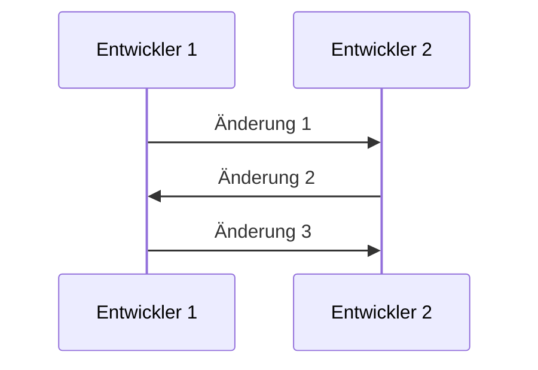
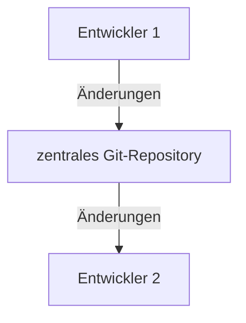

import Lead from '@components/Lead.astro'
import { Tabs, TabItem, Steps } from '@astrojs/starlight/components'

<Lead>
  Git ist eine Versionskontrolle für Projekte. Es ermöglicht die Zusammenarbeit
  zwischen mehreren Entwicklern.
</Lead>

## Was ist Git?

Git ist ein Versionskontrollsystem, das von Linus Torvalds, dem Schöpfer von Linux, entwickelt wurde. Es ermöglicht Entwicklern, Änderungen an Projekten zu überwachen und zu verwalten. Git ist besonders nützlich, wenn mehrere Entwickler an einem Projekt arbeiten und Änderungen an Dateien vornehmen.

Ein Versionsverlauf könnte so aussehen:



Stelle dir vor, du arbeitet mit jemandem zusammen an einem Projekt. Ihr beide habt Zugriff auf den Code und könnt Änderungen vornehmen. Aber wie behaltet ihr den Überblick über die Änderungen, die ihr vorgenommen habt? Wie könnt ihr sicherstellen, dass ihr nicht versehentlich den Code des anderen überschreibt? Hier kommt Git ins Spiel.

## Git installieren

Die Installation von Git ist je nach Betriebssystem unterschiedlich.

<Tabs>
  <TabItem label="macOS">
Git kann auf mehreren Wegen installiert werden. Die wohl einfachste Methode ist über [Homebrew](/guides/homebrew-chocolatey). Führe dazu den folgenden Befehl im Terminal aus:

```shell
brew install git
```

Alternativ kann Git auch über die von Apple bereitgestellten Developer Tools installiert werden, was allerdings ziemlich viel Zeit in Anspruch nehmen wird. Führe dazu den folgenden Befehl im Terminal aus:

```shell
xcode-select --install
```

Und falls alle Stricke reißen, kannst du Git auch manuell installieren. Lade dir dazu den [Git-Installer](https://git-scm.com/download/mac) herunter und führe die Installation durch.

  </TabItem>
  <TabItem label="Windows">
Ähnlich wie unter macOS gibt es auch für Windows mehrere Möglichkeiten, Git zu installieren. Die einfachste Methode unter Windows ist die über [Chocolatey](/guides/homebrew-chocolatey), das du zuvor über die Installation von Node.js bereits installiert hast. Führe zur Installation von Git mit dem folgenden Befehl in der PowerShell aus:

```shell
choco install git
```

Alternativ kannst du Git auch manuell installieren. Lade dir Git von der offiziellen [Git-Website](https://git-scm.com/download/win) herunter und installiere es.

Wenn du gefragt wirst, welcher Standard-Editor verwendet werden soll, wähle `Use Visual Studio Code as Git's default editor` aus, sofern du [Visual Studio Code](https://code.visualstudio.com/) zuvor bereits installiert hast. Wähle bei „Adjusting the name of initial branch“ die Option `Override the default branch name for new repositories`. Alles andere kannst du so lassen, wie vorgeschlagen.

  </TabItem>
</Tabs>

## Git konfigurieren

Nach der Installation von Git musst du noch einige Konfigurationen vornehmen. Öffne dazu
das Terminal und führe die folgenden Befehle aus:

```shell
git config --global user.name "Dein Name"
git config --global user.email "dein.email@example.com"
```

Mit diesen Einstellungen wird Git wissen, wer die Änderungen vorgenommen hat. Wenn du möchtest, kannst du auch noch deinen Standard-Editor, zum Beispiel Visual Studio Code festlegen:

```shell
git config --global core.editor "code --wait"
```

## Git-Basics

Ein unter Git versioniertes Projekt wird als Git-Repository bezeichnet. Ein Git-Repository kann entweder lokal auf einem Computer oder auf einem entfernten Server wie [GitHub](https://github.com) gespeichert sein.

Arbeiten zwei Menschen zusammen an einem Projekt, werden Änderungen im Git-Repository am entfernten Server synchronisiert. Hier ein kleines Schaubild:



Das funktiniert natürlich auch in die andere Richtung.

### Git-Repository erstellen

Wenn du Änderungen an den Dateien vornimmst, fügst du diese zunächst dem Staging-Bereich hinzu. Der Staging-Bereich ist ein Zwischenspeicher, in dem du Änderungen vor der Veröffentlichung überprüfen kannst. Anschließend kannst du deine Änderungen mit einem Commit bei dir lokal speichern.

Schauen wir uns das einmal an:

<Steps>

1. Erstelle ein neues Verzeichnis und wechsle in dieses Verzeichnis.

   ```shell
   mkdir mein-projekt
   cd mein-projekt
   ```

2. Erstelle eine neue Datei und füge etwas Text hinzu.

   ```shell
   echo "# Mein Projekt" > README.md
   ```

3. Stelle dein Projekt nun unter Git-Versionierung.

   ```shell
   git init
   ```

4. Füge die Datei dem Staging-Bereich hinzu und speichere deine Änderungen in deinem lokalen Repository.

   ```shell
   git add README.md
   git commit -m "Erster Commit"
   ```

5. Öffne die Datei `README.md` und nimm folgende Änderung vor:

   ```markdown title="README.md" ins=" neues "
   # Mein neues Projekt
   ```

6. Füge die Änderungen nun wie gehabt dem Staging-Bereich hinzu und speichere sie in deinem lokalen Repository.

   ```shell
    git add README.md
    git commit -m "Zweiter Commit"
   ```

</Steps>

musst du diese mit `git push` übertragen. Um dein lokales Repository mit den neuesten Änderungen aus dem entfernten Repository zu aktualisieren, verwende `git pull`.

Um dein Projekt unter Git-Versionierung zu stellen, wechsle in das Projektverzeichnis und führe den folgenden Befehl aus:

```shell
git init
```

Änderungen an deinen Dateien oder neue Dateien kannst du mit dem Befehl `git add` dem Staging-Bereich hinzufügen. Das Staging ist ein Zwischenspeicher, in dem du Änderungen vor der Veröffentlichung überprüfen kannst. Erstelle eine neue Datei oder ändere eine bestehende Datei und füge sie dem Staging-Bereich hinzu:

```shell
git add datei.js
```

Mit `git commit` kannst du deine Änderungen speichern. Wenn du deine Änderungen auf ein entferntes Repository übertragen möchtest, verwende `git push`. Um dein lokales Repository mit den neuesten Änderungen aus dem entfernten Repository zu aktualisieren, verwende `git pull`.

Ein Git-Repository ist ein Verzeichnis, in dem Git-Dateien und -Verzeichnisse speichert, um die Versionskontrolle zu ermöglichen. Eine
Ein Git-Repository ist ein Verzeichnis, in dem Git-Dateien und -Verzeichnisse speichert, um die Versionskontrolle zu ermöglichen. Eine
Wenn du dein Projekt unter Git-Versionierung stellen möchtest, wechsle in das Projektverzeichnis und führe den folgenden Befehl aus:

````shell

Wenn du dein Projekt unter Git-Versionierung stellen möchtest, wechsle in das Projektverzeichnis und führe den folgenden Befehl aus:

```shell
git init
````

Neue Dateien oder Änderungen an deiner Datei kannst du mit dem Befehl `git add` hinzufügen. Mit `git commit` kannst du deine Änderungen speichern. Wenn du deine Änderungen auf ein entferntes Repository übertragen möchtest, verwende `git push`. Um dein lokales Repository mit den neuesten Änderungen aus dem entfernten Repository zu aktualisieren, verwende `git pull`.

Git ist ein mächtiges Werkzeug, das viele Funktionen bietet. Hier sind einige der wichtigsten Befehle, die du kennen solltest:

- `git init`: Initialisiert ein neues Git-Repository.
- `git clone`: Klonen eines bestehenden Git-Repositorys.
- `git add`: Fügt Dateien zum Staging-Bereich hinzu.
- `git commit`: Speichert Änderungen im Repository.
- `git push`: Überträgt lokale Änderungen auf ein entferntes Repository.
- `git pull`: Aktualisiert dein lokales Repository mit den neuesten Änderungen aus dem entfernten Repository.

Du kannst Git auch in Visual Studio Code verwenden, denn dort ist es in der Oberfläche integriert. Wenn du mehr über Git erfahren möchtest, schau dir die [offizielle Dokumentation](https://git-scm.com/doc) an.
