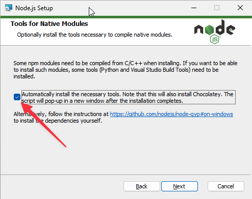
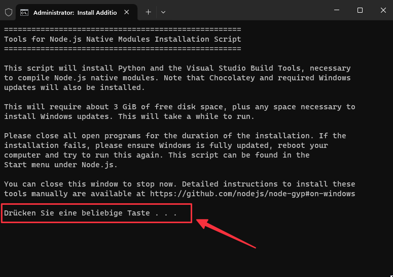

import Lead from '@components/Lead.astro'
import {
  Card,
  CardGrid,
  LinkCard,
  Tabs,
  TabItem
} from '@astrojs/starlight/components'

<Lead>
  Package Manager helfen uns dabei, eine Entwicklungsumgebung bereitzustellen.
  So installierst du sie.
</Lead>

Für einfache, statische Websites wird nur ein Webserver wie Apache oder Nginx benötigt, um diese im Browser anzuzeigen. Für die Entwicklung von modernen Websites mit komplexen Anwendungen, Bibliotheken und Abhängigkeiten werden jedoch Laufzeitumgebungen wie Node.js und Package Manager wie npm, yarn oder pnpm benötigt.

Package Manager werden über die Kommandozeile, bei macOS und Linux über das Terminal sowie bei Windows über die PowerShell verwendet. Wenn du noch nie mit der Kommandozeile gearbeitet hast, lese dir unbedingt die [Einführung](/guides/command-line) durch.

Fangen wir mit der Installation von Node.js an.

:::note
Die folgenden Schritte musst du nur einmalig auf deinem Computer durchführen. Wenn du die Tools bereits installiert hast, kannst du direkt das [Starterkits](/starterkit/intro) nutzen.
:::

## Node.js

Node.js ist die Basis für die Installation von npm, yarn oder pnpm, die wir später noch benötigen werden. Es ist eine Laufzeitumgebung, die es ermöglicht, JavaScript-Code außerhalb des Browsers auszuführen. Node.js wird für die Entwicklung von Serveranwendungen, aber auch für die Entwicklung von Webanwendungen und Tools verwendet.

Die Installation ist je nach Betriebssystem unterschiedlich.

<Tabs>
  <TabItem label="macOS">
  Die einfachste Möglichkeit, Node.js für macOS zu installieren, ist über [Homebrew](/guides/homebrew-chocolatey), einem Paketmanager für macOS. Wenn du den eingerichtet hast, führe zur Installation von Node.js folgenden Befehl in der Kommandozeile aus:

```shell
brew install node
```

Alternativ kannst du Node.js auch manuell installieren. Lade dir dazu den [Node.js-Installer](https://nodejs.org/en/download/prebuilt-installer) in der LTS-Version (Long Term Support) herunter und führe die Installation durch.

Richte als nächstes bitte Corepack ein. Um auf Nummer Sicher zu gehen, kannst du die Installation auch überprüfen und dann hierher zurückkehren.

  </TabItem>

  <TabItem label="Windows">
    Die einfachste Möglichkeit, Node.js für Windows zu installieren, ist über das Installationspaket. Lade dir jetzt Node.js in der LTS-Version (Long Term Support) von der offiziellen [Node.js-Website](https://nodejs.org/en/download/prebuilt-installer) herunter und installiere es.

Während der Installation sind ein paar Dinge zu beachten: Lasse die folgende Vorauswahl unverändert und klicke auf <kbd>Next</kbd>.


Wähle im folgenden Dialog die Checkbox aus, um weitere Tools wie [Chocolatey](/guides/homebrew-chocolatey) zu installieren und klicke auf <kbd>Next</kbd>. Diese können bei manchen Anwendungen hilfreich sein.



Nach der erfolgreichen Installation öffnet sich das Terminal zur Installation der zuvor ausgewählten Tools. Starte die Installation durch drücken einer beliebigen Taste.



:::note
Lass dich von den Statusinformationen und Warnungen im Installationsprozess nicht irritieren und gebe der Installation ein paar Minuten Zeit, bevor du das Fenster schließt.
:::

#### Ausführung von Scripten erlauben

Windows blockiert standardmäßig das Ausführen von Skripten in der PowerShell. Um das zu ändern, öffne die PowerShell als Administrator und führe den folgenden Befehl aus:

```shell
Set-ExecutionPolicy RemoteSigned -Scope CurrentUser
```

Richte als nächstes bitte Corepack ein. Um auf Nummer Sicher zu gehen, kannst du die Installation auch überprüfen und dann hierher zurückkehren.

  </TabItem>
</Tabs>

<CardGrid>
  <LinkCard title='Corepack einrichten' href='#corepack' />
  <LinkCard title='Installation überprüfen' href='/guides/checks' />
</CardGrid>

## Corepack

Viele EntwicklerInnen installieren Package Manager wie npm, yarn oder pnpm einmal auf ihrem System und steuern damit alle Projekte. Das kann schnell zu Inkompatibilitäten führen, insbesondere wenn du aktuelle und ältere Projekte gleichzeitig betreust. Im schlimmsten Fall kannst du nach dem Update des Package Managers oder deines Betriebssystems ein Projekt nicht mehr starten.

Hier kommt das mit Node.js mitgelieferte [Corepack](https://github.com/nodejs/corepack#-corepack) ins Spiel. Es fungiert als Vermittler zwischen deinem Projekt und dem Package Manager, sodass du Projekte unabhängig voneinander betreiben kannst. Corepack ermöglicht es dir, den Package Manager und dessen Version auf Projektbasis festzulegen.

Wenn du Node.js installiert hast, ist auch Corepack bereits installiert. Aktiviere es mit dem folgenden Befehl:

```shell
corepack enable
```

Corepack erstellt daraufhin sogenannte „Shims“ für die unterstützten Paketmanager. Shims sind kleine Scripte, die den für dein Projekt festgelegten Package Manager in der festgelegten Version automatisch herunterladen, sollte dieser nicht vorliegen.

Installiere dir bitte als nächstes Git. Um auf Nummer Sicher zu gehen, kannst du die Installation auch überprüfen und dann hierher zurückkehren.

<CardGrid>
  <LinkCard title='Git installieren' href='#git' />
  <LinkCard title='Installation überprüfen' href='/guides/checks' />
</CardGrid>

## Git

Git ist ein [Versionskontrollsystem](https://git-scm.com/), das verwendet wird, um Änderungen an Codeprojekten zu verfolgen, Zusammenarbeit zwischen verschiedenen EntwicklerInnen zu ermöglichen und verschiedene Versionen des Codes zu verwalten. Es wird aber auch dazu genutzt, um Softwarepakete und Bibliotheken von Repositorys zu installieren. Und genau das werden wir in Zukunft häufiger tun.

Auch hier unterscheidet sich die Installationen je nach Betriebssystem.

<Tabs>
  <TabItem label="macOS">
Git kann auf mehreren Wegen installiert werden. Die wohl einfachste Methode ist über [Homebrew](/guides/homebrew-chocolatey). Führe dazu den folgenden Befehl in der Kommandozeile aus:

```shell
brew install git
```

Alternativ kann Git auch über die von Apple bereitsgestellten Developer Tools installiert werden, was allerdings ziemlich viel Zeit in Apsruch nehmen wird. Führe dazu den folgenden Befehl in der Kommandozeile aus:

```shell
xcode-select --install
```

Und falls alle Stricke reißen, kannst du Git auch manuell installieren. Lade dir dazu den [Git-Installer](https://git-scm.com/download/mac) herunter und führe die Installation durch.

  </TabItem>
  <TabItem label="Windows">
Ähnlich wie unter macOS gibt es auch für Windows mehrere Möglichkeiten, Git zu installieren. Die einfachste Methode unter Windows ist die über [Chocolatey](/guides/homebrew-chocolatey), das du zuvor über die Installation von Node.js bereits installiert hast. Führe zur Installation von Git mit den folgenden Befehl in der PowerShell aus:

```shell
choco install git
```

Alternativ kannst du Git auch manuell installieren. Lade dir Git von der offiziellen [Git-Website](https://git-scm.com/download/win) herunter und installiere es.

Wenn du gefragt wirst, welcher Standard-Editor verwendet werden soll, wähle `Use Visual Studio Code as Git's default editor` aus, sofern du [Visual Studio Code](https://code.visualstudio.com/) zuvor bereits installiert hast. Wähle bei „Adjusting the name of initial branch“ die Option `Override the default branch name for new repositories`. Alles andere kannst du so lassen, wie vorgeschlagen.

  </TabItem>
</Tabs>

Nun kannst du mit dem Starterkit eine Website erstellen. Überprüfe falls Notwendig die Installation und kehre dann hierher zurück.

<CardGrid>
  <LinkCard title='Zum Starterkit' href='/starterkit/intro' />
  <LinkCard title='Installation überprüfen' href='/guides/checks' />
</CardGrid>
