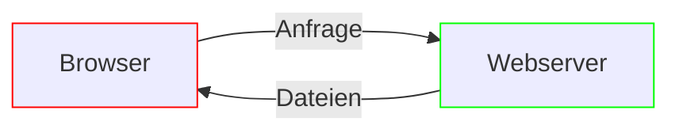

import Lead from '@components/Lead.astro'

<Lead>
  Wir richten dir die notwendigen Werkzeuge und Ressourcen ein, damit du
  Websites effizient erstellen kannst.
</Lead>

## Was du benötigst

Um eine Website zu entwickeln, benötigst du neben einem Texteditor, auch <abbr title="Integrated Development Environment">IDE</abbr> genannt, folgende Dinge:

- **Node.js** zur Ausführung von Tools wie dem [Website-Starterkit](/starterkit/intro)
- **Paketmanager** wie <abbr title="Node Package Manager">npm</abbr> zur Installation und Verwaltung von Tools
- **Webserver** zur Bereitstellung deiner Website im Browser

Folgendes Diagramm zeigt, warum ein Webserver notwendig ist:

Wenn du eine Webseite in deinem Browser aufrufst, sendet dieser eine Anfrage an einen **Webserver** (meist Apache oder Nginx). Der Webserver antwortet mit den Dateien, die für die Webseite benötigt werden (HTML, CSS, JavaScript, Bilder usw.). Der Browser interpretiert diese Daten und stellt das Resultat dar.

Ein solcher Webserver ist auch im [Website-Starterkit](/starterkit/intro) enthalten. Lass uns zur Ausführung nun Node.js und einen Paketmanager installieren.
