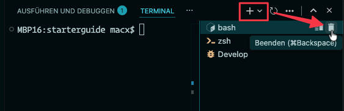
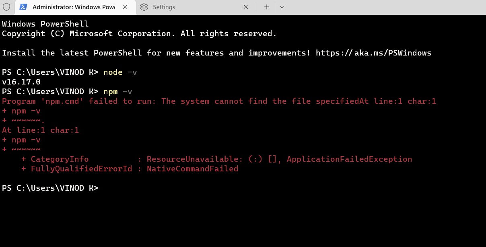
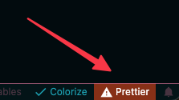

import Lead from '@components/Lead.astro'
import { Tabs, TabItem, Steps, Aside } from '@astrojs/starlight/components'

<Lead>
  Auch wenn die Installation von Node.js und Paketen meist problemlos
  funktioniert, können gelegentlich Fehlermeldungen auftreten. Hier zeigen wir
  dir, wie du diese Hürden schnell überwindest.
</Lead>

Ursachen wie fehlende Build-Tools, Rechteprobleme oder blockierte Ports sind oft systembedingt und nicht deine Schuld. Mit den folgenden Lösungen bekommst du deine Entwicklungsumgebung schnell wieder zum Laufen.

## Kompilierungsfehler (`gyp ERR` & `node-gyp`)

Die Installation von npm-Paketen kann fehlschlagen und zu roten Fehlermeldungen führen, die `gyp ERR!` oder `node-gyp` enthalten. Das passiert, wenn Pakete kompiliert werden müssen (oft C++), aber die dafür nötigen Build-Tools auf deinem Computer fehlen.

<Tabs>
  <TabItem label="macOS">

    ### Falscher Speicherort für Projekte

    Vermeide Probleme mit Node.js und npm, indem du folgende Regeln für deine Projektverzeichnisse beachtest:

    1. **Nicht in iCloud-synchronisierten Ordnern speichern**

        Nutze **niemals** `~/Desktop`, `~/Documents` oder `~/Downloads` für deine ;Coding-Projekte.

        **Grund:** Diese Ordner werden oft von iCloud Drive synchronisiert. Da `node_modules` aus Tausenden kleiner Dateien besteht, führt die Synchronisation zu Dateisperren, extremer Verlangsamung und fehlerhaften Builds. Zudem blockieren macOS-Sicherheitsrichtlinien (TCC) oft den Zugriff durch das&nbsp;Terminal.

    2. **Keine Sonderzeichen oder Schrägstriche im&nbsp;Ordnernamen**

        Vermeide Leerzeichen, Umlaute und **vor allem Schrägstriche (`/`)** in Verzeichnisnamen (z. B. nicht `ui/ux`, sondern `ui-ux`).

        **Grund:** Der Schrägstrich `/` ist in Unix-Systemen das Trennzeichen für Verzeichnisse. Ein Ordnername wie `ui/ux` zerstört den Dateipfad, da das System nach einem Unterordner sucht, der nicht existiert.

      **✅ Empfehlung:**

      Erstelle ein dediziertes Verzeichnis in deinem Benutzerordner, das nicht synchronisiert wird, z. B.: `~/Development/projekt-name` oder `~/Projekte/projekt-name`. Dieses kannst du mit dem Befehl `mkdir -p ~/Development/projekt-name` im Terminal anlegen.

      ### Fehlende Command Line Tools

      Oft liegt der Fehler in Zusammenhang mit `node-gyp` daran, dass die Xcode Command Line Tools fehlen, das ist auf dem Mac die Basis für viele Build-Tools. Diese kannst du mit folgendem Befehl installieren:

      ```shell
      xcode-select --install
      ```

      Schlägt das fehl, installiere dir die Command Line Tools manuell:

      <Steps>

      1. Gehe auf [Apple Developer Downloads](https://developer.apple.com/download/all/?q=Command%20Line%20Tools).

      2. Melde dich mit deiner Apple-ID an, die du auch im AppStore verwendest.

      3. Suche nach „Command Line Tools" passend zu deiner macOS-Version und installiere sie.

      </Steps>

      Falls hier weiterhin Fehler auftreten, kann es helfen, die fehlerhafte Installation von den Command Line Tools zu entfernen und neu zu installieren. Folge dafür der Anleitung [Reset your Xcode Install on macOS](https://gist.github.com/Justintime50/2349ff5e62555aa097acbf519bbc27af)

      ### Fehler im integrierten Terminal

      Ein frustrierendes, aber bekanntes Phänomen: Du hast die Command Line Tools installiert und im normalen Terminal funktioniert `npm install` problemlos. Doch im integrierten Terminal von VS Code hagelt es immer noch rote Fehlermeldungen (oft `node-gyp` oder `gyp ERR`).

      Auch das kann mehrere Ursachen haben. Die gebräuchlichsten hier sind:

      #### 1. Falsche Shell (`bash` statt `zsh`)

      Seit macOS Catalina (10.15) ist `zsh` die Standard-Shell auf dem Mac. Wenn du Node.js (z. B. über Homebrew) installiert hast, ist es in der Regel für `zsh` konfiguriert. Das in Visual Studio Code (VS Code) integrierte Terminal verwendet oft noch `bash`, bei der die Pfade nicht stimmen.

      Im Bereich „Terminal“ von VS Code oben rechts findest du heraus, welche Shell du nutzt: Es gibt rechts oben ein Dropdown-Menü, das die aktuell genutzte Shell anzeigt.

      

      Mit dem Klick auf das `+`-Symbol kannst du ein neues `zsh`-Terminal öffnen. Schließe dann mit einem Klick auf das Mülltonnen-Symbol das alte `bash`-Terminal.

      Mit dem Befehl `echo $SHELL` kannst du im Terminal selbst überprüfen, welche Shell gerade aktiv ist. Erscheint `/bin/zsh`, ist alles korrekt. Steht dort `/bin/bash`, solltest du das ändern.

      Damit sich in VS Code beim nächsten Mal automatisch `zsh` öffnet, kannst du das Standard-Profil ändern:

      <Steps>

      1. Öffne die Befehlspalette (<kbd>⌘ Command</kbd> + <kbd>⇧ Shift</kbd> + <kbd>P</kbd>).

      2. Suche nach `Terminal: Select Default Profile`.

      3. Wähle **zsh** aus.

      </Steps>

      #### 2. Fehlende Pfade

      Eine weitere Fehlerquelle sind fehlende Pfade zu wichtigen Tools wie Python. Python ist eine Voraussetzung für `node-gyp`, da es Teile des Codes in C++ kompiliert. Was im Hintergrund da genau passiert, ist jetzt nicht relevant. Wichtig ist nur, dass wir dafür sorgen, dass `node-gyp` Python auch findet. Das machen wir über die sogenannten Umgebungsvariablen (`PATH`).

      Gib im **integrierten Terminal von VS Code** folgenden Befehl ein, um zu überprüfen, ob der Pfad gesetzt ist:

      ```shell
      which python3
      ```

      Wenn da kein Ergebnis kommt (aber im normalen Terminal schon), übernimmt VS Code die Pfade nicht korrekt. Das kannst du so beheben:

      <Steps>

      1. Öffne in VS Code die Einstellungen (<kbd>⌘ Command</kbd> + <kbd>,</kbd>).

      2. Suche nach `terminal.integrated.inheritEnv` und aktiviere es.

      </Steps>

      #### 3. Rosetta-Modus

      Auf Macs mit Apple Silicon (M1, M2, M3, M4 usw.) kann es passieren, dass VS Code im „Rosetta-Modus" (für Intel-Chips) läuft, während dein System und Node.js nativ auf `arm64` laufen. Dieser Architektur-Mix führt zu Fehlern beim Kompilieren.

      Prüfe im Terminal durch die Eingabe von `arch`, ob VS Code im falschen Modus läuft. Erscheint `i386`, musst du die Einstellung ändern:

      <Steps>

      1. Beende VS Code vollständig.

      2. Öffne den Finder und gehe zu „Programme".

      3. Rechtsklick auf „Visual Studio Code" > „Informationen".

      4. Entferne den Haken bei **„Mit Rosetta öffnen"**.

      </Steps>

    </TabItem>

    <TabItem label="Windows">
    ### Fehlende Build Tools

      Unter Windows fehlen oft die C++ Build Tools und Python, die für `node-gyp` benötigt werden.

      Am einfachsten installierst du diese Tools über den Node.js Installer:

      <Steps>

        1. Lade dir den aktuellen [Node.js Installer](https://nodejs.org/) herunter und führe ihn aus.

        2. Wähle im Installationsprozess die Option **"Automatically install the necessary tools..."** aus. Dies installiert Chocolatey, Python und die Visual Studio Build Tools.

      </Steps>

      :::note
      Im Abschnitt [Node.js und Paketmanager](/guides/nodejs/) findest du weitere Informationen zur Installation von Node.js auf Windows.
      :::

    </TabItem>

</Tabs>

## Berechtigungen & Skripte

Oft scheitert es schon ganz am Anfang: Du darfst keine Skripte ausführen oder hast keine Schreibrechte.

<Tabs>
  <TabItem label="macOS">
    **Fehlende Rechte (EACCES)**

    Wenn Node.js oder npm mit `sudo` installiert wurden oder wenn die Standard-Verzeichnisse für globale Pakete nicht dem aktuellen Benutzer gehören, kommt es zu Problemen bei der Rechtevergabe. So kannst du das beheben:

    ```shell
    sudo chown -R $(whoami) $(npm config get prefix)/{lib/node_modules,bin,share}
    ```

  </TabItem>

  <TabItem label="Windows">
    **Skripte können nicht ausgeführt werden**

    Windows blockiert standardmäßig das Ausführen von Skripten in der PowerShell. Das sieht dann etwas so aus:

    

    Um das zu ändern, öffne die PowerShell als Administrator und führe den folgenden Befehl aus:

    ```shell
    Set-ExecutionPolicy RemoteSigned -Scope CurrentUser
    ```

    Schließe anschließend die PowerShell und öffne sie erneut.

  </TabItem>
</Tabs>

## Port bereits belegt (`EADDRINUSE`)

Wenn du versuchst, deinen Entwicklungsserver zu starten (z. B. mit `npm start` oder `npm run dev`), und eine Fehlermeldung mit `EADDRINUSE` erhältst, bedeutet das, dass der Port bereits von einem anderen Programm verwendet wird. Ein Port steht für eine bestimmte Netzwerkverbindung und kann nur von einem Programm gleichzeitig genutzt werden.

Im folgenden verwenden wir beispielhaft den Port `1234`. Ersetze ihn durch den Port, der in deiner Fehlermeldung angegeben ist.

<Steps>

1.  Schließe andere Terminal-Fenster, in denen vielleicht noch ein Entwicklungsserver läuft.

2.  Beende den blockierenden Prozess:

    ```shell
    npx kill-port 1234
    ```

3.  Funktioniert das nicht, finde die Prozess-ID (PID) und beende den blockierenden Prozess manuell:

        <Tabs>
          <TabItem label='macOS'>

            ```shell
            lsof -i :1234
            kill -9 <PID>
            ```

          </TabItem>

          <TabItem label='Windows'>

            ```shell
            netstat -ano | findstr :1234
            taskkill /PID <PID> /F
            ```

          </TabItem>

    </Tabs>

</Steps>

## Abhängigkeitskonflikte (`ERESOLVE`)

Manchmal können sich verschiedene Pakete nicht auf eine gemeinsame Version einer Abhängigkeit einigen. Du siehst dann einen Fehler, der mit `ERESOLVE unable to resolve dependency tree` beginnt.

Versuche, die Abhängigkeiten mit dem Flag `--legacy-peer-deps` zu installieren:

```shell
npm install --legacy-peer-deps
```

Wenn das nicht hilft, überprüfe die `package.json`-Datei auf widersprüchliche Versionsangaben und passe sie gegebenenfalls an.

## Probleme mit dem Starterkit

Fehler im Zusammenhang mit dem [Starterkit](/starterkit/intro) haben ihre Ursache in den meisten Fällen durch einen fehlerhaften Umgang.

### Fehlermeldung `parcel: command not found`

Das Starterkit nutzt [Parcel](https://parceljs.org/) als Build-Tool. Wenn du beim Starten des Entwicklungsservers die Fehlermeldung `parcel: command not found` erhältst, bedeutet das, dass du die Abhängigkeiten des Projekts nicht installiert hast. Hole das mit dem folgenden Befehl wie nach.

```shell
npm install
```

### Fehler mit Prettier (`SyntaxError`)

Wenn du in VS Code das Profil [HAWK GT1191](https://hawk-gt1191.de/tutorials/website-mit-visual-studio-code#plugins-und-konfiguration) nutzt, ist Prettier bereits vorkonfiguriert. Prettier formatiert deine Quelldateien und erzeugt daraus die Ausgabe, die im Buildprozess und später im Browser geladen wird. Scheitert die Validierung (z. B. wegen ungültigem HTML oder fehlerhaftem CSS), wird keine neue Ausgabedatei erzeugt — deine Änderungen erscheinen dann nicht im Browser.

Ein roter Prettier‑Button in der Statusleiste oder Hinweise im „Problems“-Tab (`Cmd + Shift + M`) zeigen die genauen Parser‑/Syntaxfehler an.



Korrigiere die gemeldete Stelle und speichere die Datei, damit der Formatter/Buildprozess wieder eine aktualisierte Ausgabe erzeugt. Dann sollten deine Änderungen im Browser wieder sichtbar sein und der Prettier‑Button ändert seine Farbe.

### Fehler beim Anlegen einer Kopie

Wenn du dir eine Vorlage oder ein Beispielprojekt kopierst, um daran zu arbeiten, kann es zu Problemen kommen, wenn du mehr kopierst als nötig. Wichtig für dich sind lediglich die Quelldateien im Verzeichnis `src` und die Datei `package.json`.

Die Verzeichnisse `node_modules` und `.parcel-cache`, sowie die Datei `package-lock.json` solltest du löschen. Danach kannst du die Abhängigkeiten mit `npm install` wieder neu installieren. Das sollte das Problem beheben.
